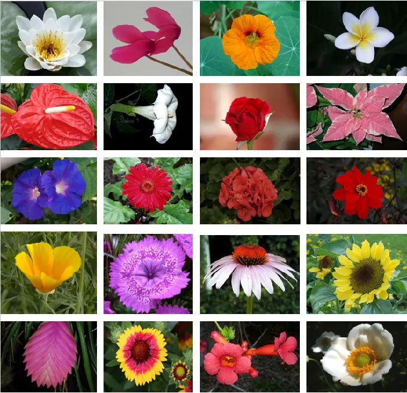

# Flower Classification Model

  

### Overview
This is a TensorFlow model for classifying images of flowers into different categories. The model is trained on a dataset of flower images using a TPU (Tensor Processing Unit) for faster training.

### Requirements
- TensorFlow 2.x
- TensorFlow Datasets
- Kaggle Datasets (for accessing the flower dataset)
- Matplotlib (for visualization)

### Usage
1. **Set up TPU**: Ensure that you have access to a TPU (Tensor Processing Unit) for faster training. The model is configured to run on a TPU.
2. **Install Dependencies**: Install the required dependencies using the following command:
"""
pip install tensorflow tensorflow_datasets kaggle_datasets matplotlib
"""
3. **Download the Dataset**: Download the flower dataset from Kaggle. Make sure you have a Kaggle account and configure your Kaggle API credentials.
4. **Prepare the Dataset**: After downloading the dataset, specify the path to the TFRecords files in the code (GCS_PATH). The dataset should be in TFRecords format.
5. **Training**: Run the training script to train the model. The training script will automatically distribute the training across the available TPU cores.
6. **Showing Similar Flowers**: Use the show_similar_flowers function to display similar flowers based on the category predicted by the model. Provide the path to the flower image you want to classify as input to this function.

### Model Architecture
The model architecture used is EfficientNetB6, a convolutional neural network pre-trained on the ImageNet dataset. The final layer is replaced with a Global Average Pooling layer followed by a Dense layer with softmax activation for classifying the flowers into different categories.